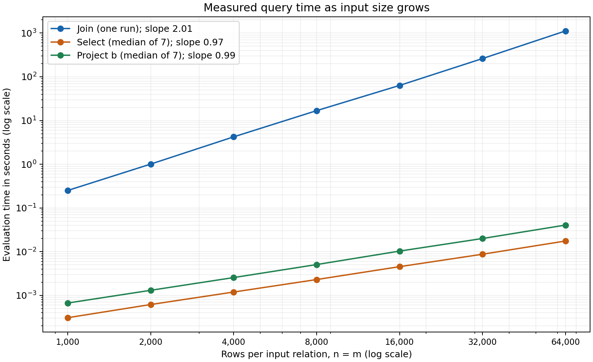

# Performance report

Machine: MacBook Air (Mac15,13), Apple M3, 8 CPU cores, 16 GB memory. OS: macOS 26.6, arm64. Language: Python 3.13.1 (CPython). Measurements: 2026-09-23.

## Setup

I used `experiment.py` to generate relation files, load them and run the queries. R has columns `(a,b)` and S has `(b,c)`. All R rows have `b=0`; in the main experiment exactly one S row has `b=0`. The `a` and `c` values are unique, so the input rows stay distinct. Each R row matches one S row. This is a controlled dataset: many rows share the same join key.

The engine's `perf_counter()` timer covers running the query, including checking the condition's column names, building result rows and counting work. Generating and loading files, parsing the query and printing results are outside the timer. The join uses nested loops and passes every pair to selection, keeping only matches. It does not store all pairs first. It still checks every pair and uses no index or hash join.

The join counter increases once per pair inside the selection loop. The selection counter also increases for that pair, so the two counts describe the same work and should not be added. `measurements.jsonl` contains the actual counts and unrounded times, saved after each query. The runner checks the counts after timing; it does not fill them in from a formula.

## Join measurements

Query: `R join[R.b=S.b] S`. One timed run per size, in increasing order, with one match per R row.

| n | m | Comparisons | Wall time (s) | Output tuples |
| ---: | ---: | ---: | ---: | ---: |
| 1,000 | 1,000 | 1,000,000 | 0.304460 | 1,000 |
| 2,000 | 2,000 | 4,000,000 | 1.217272 | 2,000 |
| 4,000 | 4,000 | 16,000,000 | 4.899501 | 4,000 |
| 8,000 | 8,000 | 64,000,000 | 19.670189 | 8,000 |
| 16,000 | 16,000 | 256,000,000 | 80.549386 | 16,000 |
| 32,000 | 32,000 | 1,024,000,000 | 347.868669 | 32,000 |
| 64,000 | 64,000 | 4,096,000,000 | 1408.401873 | 64,000 |

### 1. Comparison count

The measured count is exactly `n * m` at every size. For each R row, the inner loop checks all m S rows, even after a match. At 64,000 rows per side, the actual counter is `64,000 * 64,000 = 4,096,000,000`. With n=m this is n². There is no discrepancy.

### 2. Time and slope



I fitted a straight line to `log10(n)` and `log10(seconds)` using all seven sizes. The join slope is **2.032**. A slope near 2 means time grows roughly as n²: doubling both inputs gives about four times as many comparisons. These times can vary with other computer activity and memory use. The join was run once per size.

### 3. Selection and projection

At each size I ran `select[a<n/2](R)`, replacing `n/2` with the actual integer, and `project[b](R)`. For example, at n=1,000 the selection is `select[a<500](R)`. I used the median of seven evaluation times because these queries finish quickly. Each run used the same already-loaded tables.

| n | Select seconds | Rows examined | Select output | Project seconds | Project output |
| ---: | ---: | ---: | ---: | ---: | ---: |
| 1,000 | 0.000306 | 1,000 | 500 | 0.000654 | 1 |
| 2,000 | 0.000592 | 2,000 | 1,000 | 0.001275 | 1 |
| 4,000 | 0.001188 | 4,000 | 2,000 | 0.002557 | 1 |
| 8,000 | 0.002392 | 8,000 | 4,000 | 0.005467 | 1 |
| 16,000 | 0.004695 | 16,000 | 8,000 | 0.013489 | 1 |
| 32,000 | 0.009283 | 32,000 | 16,000 | 0.020305 | 1 |
| 64,000 | 0.018236 | 64,000 | 32,000 | 0.041021 | 1 |

Selection has slope **0.986** and projection has slope **1.011**. Selection examines n rows and returns half. Projection visits n rows but produces one distinct `b` value, so checking for duplicates is quick. Both times grow roughly with n for this dataset, while the join checks n² pairs. Projection can be slower with many distinct output rows because this engine checks saved rows one by one. Loading can be slow for the same reason, but loading is outside the query timer.

### 4. Prediction for one million rows per side

Using the largest measured join and quadratic scaling:

```text
scale = (1,000,000 / 64,000)^2 = 244.140625
predicted time = 1408.401873 seconds * 244.140625
               = 343,848.11 seconds
               = 95.51 hours
comparisons = 1,000,000 * 1,000,000 = 1,000,000,000,000
```

This predicts evaluation time with the same implementation and one match per R row. It excludes loading and printing and assumes similar time per pair. I did **not** run the million-row join.

### 5. Changing the match rate

I held n=m=1,000 fixed, regenerated the inputs with different match counts and ran each setting three times. Times below are medians.

| S matches per R row | Comparisons per run | Wall time (s) | Output tuples |
| ---: | ---: | ---: | ---: |
| 0 | 1,000,000 | 0.316162 | 0 |
| 1 | 1,000,000 | 0.302644 | 1,000 |
| 1,000 | 1,000,000 | 0.482768 | 1,000,000 |

Every run still makes 1,000,000 comparisons because the nested loops visit every pair. Time can change because matching rows must be saved. The all-match case stores one million rows; the zero-match case stores none. That extra work helps explain why equal comparison counts can have different times. Small differences can also be measurement noise.

### 6. Making a million-row join feasible

For this equality join, I would use a hash join: group one table by its join key, then look up matching groups for rows in the other table. That should take work closer to n+m plus the output size, instead of n*m. I would also make duplicate checking faster and write large results as they are produced. If the tables did not fit in memory, I would split them into disk partitions. A high match rate can still make the output huge. These are proposed changes; the measured engine uses nested loops.

## Reproducing the study

From this folder, run `python3 experiment.py --output new-measurements.jsonl` for a fresh experiment. It takes a long time and will not overwrite an existing results file. This report uses `measurements.jsonl`; `python3 plot_results.py` reads it and redraws `performance.png` with matplotlib 3.10.8. The engine itself uses only the Python standard library.
